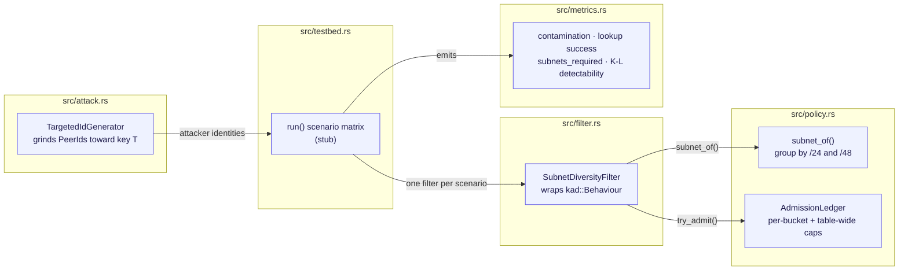
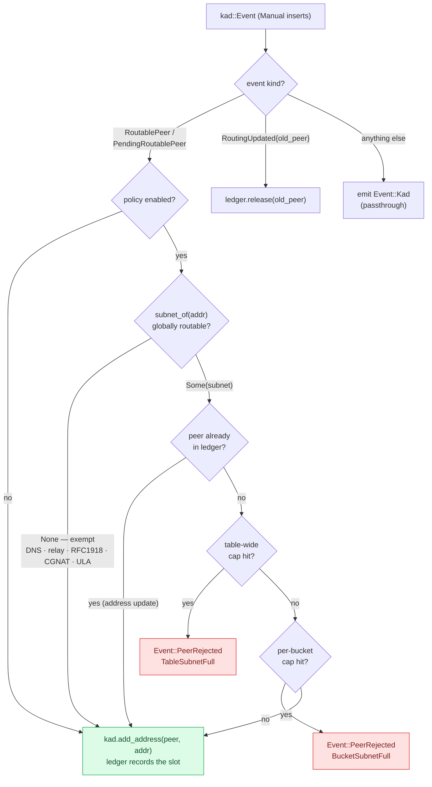

# kad-eclipse-testbed

An empirical testbed for eclipse attacks on rust-libp2p's Kademlia DHT.

> **Status: scaffold, pre-measurement.** The attack grinder, the diversity
> policy, the reference filter and the metrics are written. `testbed::run` is a
> stub. The crate **compiles** — `cargo check` is green against
> `libp2p-kad-v0.49.0` (in `libp2p 0.57`) on Rust 1.98.1 — but `make all` is not
> yet green: `cargo fmt`, one `clippy` lint and two `policy` tests still need
> fixing. Not published to crates.io, deliberately.

## What this is for

Eclipse-resistance proposals in rust-libp2p have failed on evidence, not on
merit. Issues [#4769][4769] (Sybil defence) and [#1352][1352] (authenticated
stratified k-buckets) were both closed without landing. Meanwhile go-libp2p has
shipped `peerdiversity` inside `go-libp2p-kbucket` for years, and py-libp2p
merged per-subnet caps in [#1399][1399].

The gap is not that nobody has proposed a defence. It is that nobody has
published a number.

This repository exists to produce that number. The reference filter in
`src/filter.rs` is here so the testbed has something to measure — it is
explicitly **not** a library for other crates to depend on, and it says so in
its own docs.

## The state of play

| | go-libp2p | py-libp2p | rust-libp2p |
|---|---|---|---|
| Disjoint lookup paths | — | missing | present, opt-in, off by default |
| IP/subnet diversity in k-buckets | shipped, /16 | shipped, /24 ([#1399][1399]) | **missing** |
| Eclipse testbed on real nodes | — | simulation only | **none** |

## The questions

Pre-registered in [`docs/methodology.md`](docs/methodology.md), written before
any measurement exists so that nobody — including the author — can tune the
experiment until it says something convenient.

1. **Does a subnet cap reduce contamination of the victim's k-closest set?**
2. **How many distinct subnets must an attacker rent to undo it?** This is the
   number that converts to money, since identities are free and address
   diversity is not.
3. **What fraction of honest peers does it wrongly reject?** A defence that
   locks out legitimate peers behind large ISPs is not shippable regardless of
   how well it scores on the first two.

There is also a standing disagreement worth settling: go-libp2p groups IPv4 by
/16, py-libp2p by /24. Nobody has published a comparison. `--prefix-v4` sweeps
it.

**What would falsify the hypothesis** is stated up front in the methodology, and
a negative result gets published the same as a positive one.

## Usage

```sh
# How cheap is a targeted identity? Runs standalone, no network.
cargo run --release -- grind --trials 1000000 --keep 20

# The scenario matrix (once testbed::run exists)
cargo run --release -- run --scenario all --output docs/results/matrix.json

# The /16-vs-/24 sweep
cargo run --release -- run --scenario diversity --prefix-v4 16
cargo run --release -- run --scenario diversity --prefix-v4 24
```

## Layout

```
src/
  attack.rs      TargetedIdGenerator — grinds peer IDs toward a key
  policy.rs      subnet grouping, global-routability, AdmissionLedger
  filter.rs      SubnetDiversityFilter — reference impl, NOT a stable API
  metrics.rs     five metrics incl. K-L eclipse detectability
  testbed.rs     five-scenario matrix (run() is a stub)
  main.rs        CLI
docs/
  methodology.md  pre-registered protocol, controls, falsification criteria
  threat-model.md attacker model, why signing and disjoint paths don't close it
  repo-setup.md   branch rules and one-time gh commands
```

## How it fits together



## Why the filter is not the product

`SubnetDiversityFilter` wraps `kad::Behaviour` and depends on the *event
semantics* of `BucketInserts::Manual` — that `RoutablePeer` means "kad is asking
permission." That is an observable implementation detail, not a documented
contract, so a kad minor release could change its meaning without breaking
compilation. Silent semantic drift is the worst failure mode a security
component has.

The admission decision it makes on every peer, under `BucketInserts::Manual`:



Rejection is refusal of a routing-table *slot*, never an eviction of a resident
peer — the reject-don't-evict semantics py-libp2p #1399 also ships.

The durable version of this belongs behind an explicit hook inside
`libp2p-kad`, the way go-libp2p put `peerdiversity` inside the kbucket package
rather than wrapping it from outside. Whether such a hook is in scope is a
question for the maintainers, and the right time to ask is after there are
numbers — not before.

## Who this is for

The primary customer is **py-libp2p**, not rust-libp2p.

py-libp2p ships `MAX_PEERS_PER_SUBNET = 2`, `/24`, `/48` ([#1399][1399]) and a
table-wide cap defaulting to `0` (#1442). go-libp2p uses `/16` and
`maxForTable=3`. This repository's scaffold picked `6`. Three implementations,
three answers, and no measurement behind any of them.

rust-libp2p is option value, not the thesis. As of September 2026 it has had no
non-dependabot merge in over five weeks; `libp2p-kad` has since moved 0.48.0 →
0.49.0 (in `libp2p 0.57`), which this crate now builds against, but nothing here
is sequenced behind an upstream decision regardless.

## Roadmap

Full version with exit criteria and kill conditions in
[`docs/dev-plan.md`](docs/dev-plan.md). Phases are ordered by value per unit of
effort, not by dependency — the most valuable measurement here does not need
the testbed to exist.

0. Make it compile.
1. The premise number: how fast can a laptop grind a full k-bucket of targeted
   identities?
2. **Honest-peer rejection against the real Amino DHT** — a crawl snapshot
   grouped by subnet answers Q3 directly, with no Rust involved. Cheapest
   phase, highest value, and the one most likely to find a bug in already-
   merged py-libp2p code.
3. Cross-implementation conformance vectors for subnet grouping.
4. The in-memory testbed. The expensive phase, deliberately last-but-one.
5. Full matrix, statistics, and the /16-vs-/24 sweep.
6. Publish — py-libp2p defaults first, rust-libp2p question last.

## Related work by the author

- [py-libp2p #1399][1399] — IP subnet diversity in Kademlia k-buckets (merged)
- py-libp2p #1442 — configurable and table-wide subnet limits (in review)

## License

MIT OR Apache-2.0

[4769]: https://github.com/libp2p/rust-libp2p/issues/4769
[1352]: https://github.com/libp2p/rust-libp2p/issues/1352
[1399]: https://github.com/libp2p/py-libp2p/pull/1399
[arxiv]: https://arxiv.org/abs/2505.01139
