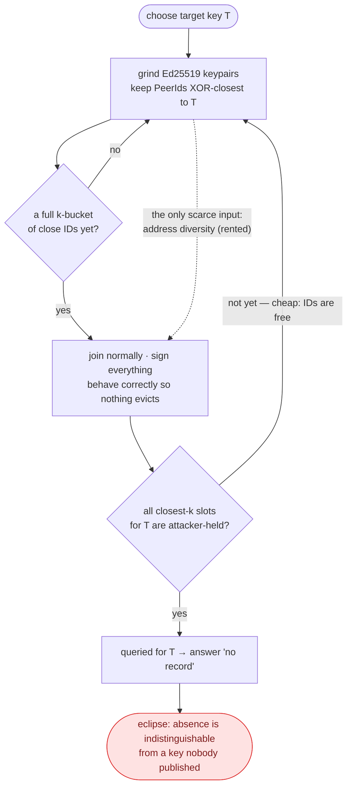

# Threat model

## Attacker

A single party able to:

- generate unlimited Ed25519 keypairs (free — a peer ID is `multihash(pubkey)`
  with no additional constraint)
- run peers that speak the Kademlia protocol correctly and sign everything
  validly
- control some number of distinct IP addresses, across some number of distinct
  subnets

The last line is the only scarce resource, and it is the entire reason subnet
diversity is worth studying. Identities are free; address diversity is rented.

**Not assumed:** ability to break signatures, partition the network at the
transport layer, or compromise honest nodes.

## Attack

1. Choose a target key `T`.
2. Grind keypairs, keeping those whose `PeerId` lands XOR-closest to `T`.
3. Join the network normally. Behave correctly, so nothing evicts you.
4. Occupy the "closest to `T`" slots in honest routing tables.
5. When queried for `T`, answer "no record".

Step 5 is why this is hard to detect: the attacker never has to produce a
forged record. Reporting absence is indistinguishable from a key nobody
published.

## Why record authentication does not help

py-libp2p #1348 and #1339 bind records to their signer. That closes record
forgery. It does not touch this attack, because the attack is in the routing
layer, not the record layer — the attacker's messages are all validly signed and
all truthful about what they hold, which is nothing.

## Why disjoint lookup paths are not sufficient

S/Kademlia's disjoint query paths are a *traversal* defence: they make it harder
for a single adversarial peer to steer a lookup. But once the closest-k slots
for `T` are all attacker-held, every path terminates in the same adversarial
set. No value of `d` yields an adversary-free path. Disjoint paths raise the
cost of a *partial* eclipse; they do not address placement.

This is worth stating clearly because it inverts the priority order in the
original writeup this repository grew out of.

## Why subnet diversity is the interesting lever

It is the only widely-deployed defence that touches *placement* rather than
traversal, and it converts the attacker's cheap resource (identities) into a
dependency on their expensive one (address diversity). It cannot stop an ID from
being minted. It can stop it from being seated.

It is also not free, and the cost falls on honest peers behind large ISPs and
cloud providers. Quantifying that cost is Q3 in `methodology.md` and is the
question most likely to determine whether this is shippable.

## Prior art

- **go-libp2p** — `peerdiversity` inside `go-libp2p-kbucket`. Per-group and
  table-wide caps, IPv4 grouped by /16. Notably a *hook inside* the routing
  table, not a wrapper around it.
- **py-libp2p** — PR #1399 (merged), per-bucket cap, IPv4 /24, IPv6 /48.
  PR #1442 adds configurability and a table-wide cap.
- **rust-libp2p** — nothing. `kbucket_inserts` chooses between `OnConnected`
  and `Manual`; neither is address-aware.
- **S/Kademlia** (Baumgart & Mies, 2007) — crypto-puzzle IDs plus disjoint
  paths. The puzzle half needs an ecosystem-wide spec change.
- **Cholez et al.** — K-L divergence detection of ID clustering in the KAD
  network; applied recently to the IPFS DHT in arXiv:2505.01139.

## Open disagreement worth resolving

go-libp2p groups IPv4 by /16; py-libp2p by /24. The argument for /24 is that a
cloud tenant's addresses are scattered across /24s anyway, so a /16 cap mostly
penalises honest peers behind large ISPs. The argument for /16 is that /24 is
trivially cheap to acquire in bulk. Nobody has published a number. That sweep is
wired through this testbed's CLI (`--prefix-v4`) and is a genuine
ecosystem-level contribution independent of whether any code lands upstream.
